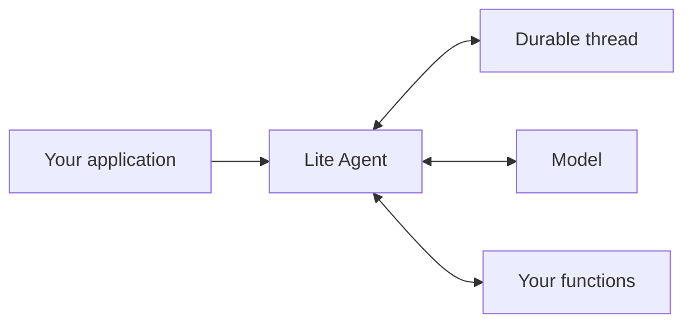
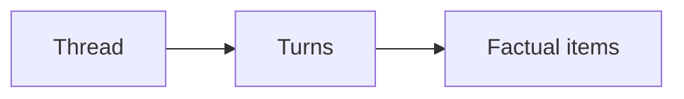

# Lite Agent

Lite Agent is a Rust library for building agents with tool-assisted workflows. It gives an application a durable conversation, a streaming agent loop, and clear places to add its own functions and policies.

It is intentionally business-agnostic. Your application owns the domain knowledge and user experience; Lite Agent coordinates the conversation and records what happened.

> This project is under active development. Public APIs may change before the first release.

## Core Idea

An application sends user input to an agent. The agent reads and updates a durable thread, talks to a model, and calls only the functions the application has registered.



The library does not use skills or embed business logic in the loop. Functions are explicit and registered by the application.

## Durable Conversations

A thread is the durable conversation. It contains turns, and each turn contains append-only factual items from the user, model, tools, or runtime.



For example, user input, an assistant response, a tool call, and its output are all recorded as facts. The current conversation view is derived from this history, so it can be reconstructed, compacted for long-running threads, and traced without guessing.

## Quick Start

The REPL is a local example of using the library with an OpenAI-compatible Chat Completions endpoint. It is not a deployment model.

```bash
export LITE_AGENT_API_KEY="your-api-key"

cargo run -p lite-agent-repl -- repl \
  --model your-model
```

For another OpenAI-compatible provider, set its endpoint explicitly:

```bash
export LITE_AGENT_API_KEY="your-api-key"

cargo run -p lite-agent-repl -- repl \
  --base-url https://api.deepseek.com \
  --model deepseek-chat
```

Useful options include:

```text
--thread ID              Resume a specific thread
--state-dir PATH         Change the local state directory
--command-cwd PATH       Working directory for the example command function
--reasoning-effort VALUE Model reasoning-effort setting
```

The example also writes logs and per-thread traces to the state directory:

```text
.lite-agent/
  threads/<thread_id>.json
  traces/<thread_id>.jsonl
  lite-agent.log
```

## Library Usage

An application can assemble the runtime from the provided adapters:

```rust,no_run
use lite_agent_kernel::new_id;
use lite_agent_openai::{ChatCompletionsClient, ModelConfig};
use lite_agent_observability::JsonlTraceCollector;
use lite_agent_runtime::{builtin_registry, Agent, AgentConfig};
use lite_agent_store_json::JsonFileThreadStore;
use std::sync::Arc;

#[tokio::main]
async fn main() -> lite_agent_runtime::Result<()> {
    let state_dir = ".lite-agent";
    let thread_id = new_id("thread");
    let store = Arc::new(JsonFileThreadStore::open(state_dir)?);
    let model = Arc::new(ChatCompletionsClient::new(ModelConfig {
        base_url: "https://api.openai.com/v1".to_string(),
        api_key: std::env::var("LITE_AGENT_API_KEY").unwrap(),
        model: "your-model".to_string(),
        reasoning_effort: "medium".to_string(),
    }));
    let trace = JsonlTraceCollector::new(state_dir)?;

    let agent = Agent::new(
        AgentConfig::default(),
        store,
        model,
        builtin_registry(),
    )
    .with_trace_collector(trace);

    let outcome = agent.run_turn(&thread_id, "Hello").await?;
    println!("{outcome:?}");
    Ok(())
}
```

## Extension Points

The runtime is designed to be assembled rather than subclassed.

| Need | Extension point |
| --- | --- |
| Use another model provider | Implement `ModelClient` |
| Add application functions | Register an `AgentFunction` or `SimpleFunction` |
| Apply authorization or auditing around calls | Add `FunctionCallHook` implementations |
| Store threads elsewhere | Implement `ThreadStore` |
| Change context selection or compaction | Implement `ContextBuilder` and `ContextCompactor` |
| Collect trajectory data | Implement `TraceCollector` |
| Change UI or streaming presentation | Map `TurnStreamEvent` in the host |

The built-in functions are deliberately small and scoped to the runtime. Applications add domain behavior through registered functions rather than through skills or hidden business logic in the loop.

## Trajectory Tracing

Tracing is optional. The runtime exposes a provider-neutral `TraceCollector` contract, while `lite-agent-observability` provides `JsonlTraceCollector`.

The JSONL collector writes one file per thread and records the logical trajectory:

- user input
- atomic model responses
- function calls
- committed tool outputs
- suspension and terminal turn status

Trace collection is best-effort and does not change turn correctness. Applications should call the collector's async `flush()` during shutdown so buffered records are written and synchronized to storage.

## Development

Run the workspace checks from the repository root:

```bash
cargo fmt --all
cargo check --workspace
cargo test --workspace
cargo clippy --workspace --all-targets -- -D warnings
```
